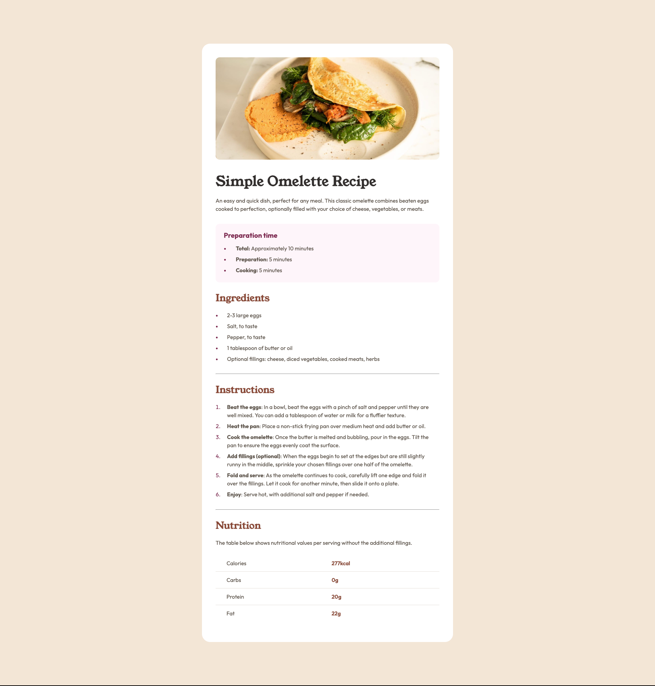
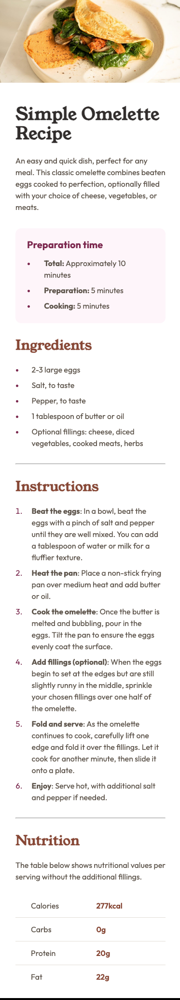

## Table of contents

- [Overview](#overview)
  - [Screenshot](#screenshot)
  - [Links](#links)
- [My process](#my-process)
  - [Built with](#built-with)
  - [What I learned](#what-i-learned)
- [Author](#author)

## Overview

### Screenshot

> [!NOTE] desktop view
- 

> [!NOTE] Mobile view
- 

### Links

- Solution URL: [github link](https://github.com/itadori-kun/Simple-recipe-meal.git)
- Live Site URL: [Netlify](https://simple-recipe-meal.netlify.app/)

## My process

### Built with

- Semantic HTML5 markup
- CSS custom properties
- Desktop-first workflow

### What I learned

Learnt a bit about accessibility and using aria-labels. 

## Author

- Frontend Mentor - [@itadori-kun](https://www.frontendmentor.io/profile/yourusername)
- Twitter - [@godwincruise](https://www.twitter.com/yourusername)
